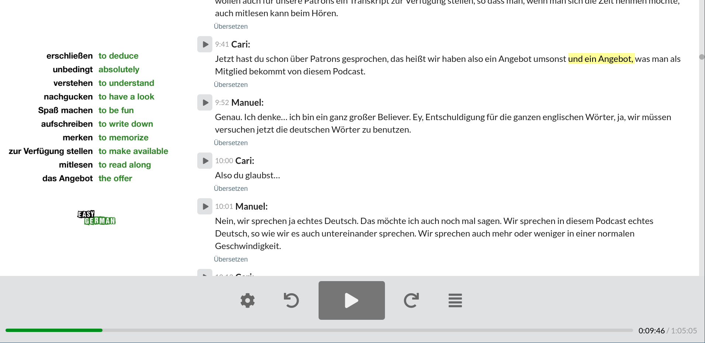

# README

This repository contains the source code for the interactive transcript of the incredible [Easy German Podcast](https://www.easygerman.org/podcast). 
The transcripts are available to the Easy German Members; however, the transcript of the [first episode](https://www.easygerman.org/podcast/episodes/1) is free for all to see. You can see how this interactive transcript works [here](https://play.easygerman.fm/episodes/1).

The interactive transcript highlights the words as they are being played and allows the user to translate the sections using [DeepL translator](https://www.deepl.com/translator). It also shows the Easy German Vocabulary Helper on the side. 




## Installation

### Requirements

* Ruby - best to install it with [rbenv](https://github.com/rbenv/rbenv) or [rvm](https://rvm.io/).
* Node.js
* PostgreSQL
* EasyGerman private podcast URL (from Patreon)
* DeepL API key (for translations)
* Rollbar (for error reporting)

### Application setup

```sh
gem install bundler
bundle install
cp .env.development.sample .env.development
cp config/database.yml.example config/database.yml
```

Customize .env.development and database.yml.

Set up the database:

```sh
rails db:setup
```

### Starting the server

```sh
./bin/run
```

## Running the tests

```sh
bundle exec rspec
```

or use guard to run tests as files change:

```sh
guard
```

## Deployment to Heroku

On Heroku Dashboard:

* create app
* add PostgreSQL and Redis add-ons
* set environment variables (refer to .env.development - ignore DATABASE_URL & REDIS_URL, these are set automatically by Heroku)

On the CLI:

```sh
git remote add heroku https://git.heroku.com/<appname>.git
git push heroku master
```

## Rake tasks

- `rake feed:stats` - print stats about all episodes
- `rake translations:prepopulate` - pre-translate all transcripts
